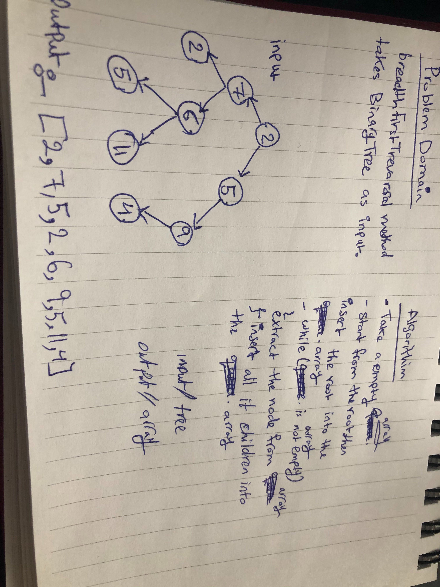

# data-structures-and-algorithms

# Challenge Summary
- Tree

## Challenge Description

breadth first traversal method which takes a Binary Tree as its unique input. Without utilizing any of the built-in methods available to your language, traverse the input tree using a Breadth-first approach, and return a list of the values in the tree in the order they were encountered.

## Approach & Efficiency
- add O(logn)

- includes O(logn)

- inOrder(),postOrder(),preOrder()  : O(n)

- breadthFirstTrevarsal(tree) : o(n)
## Solution

