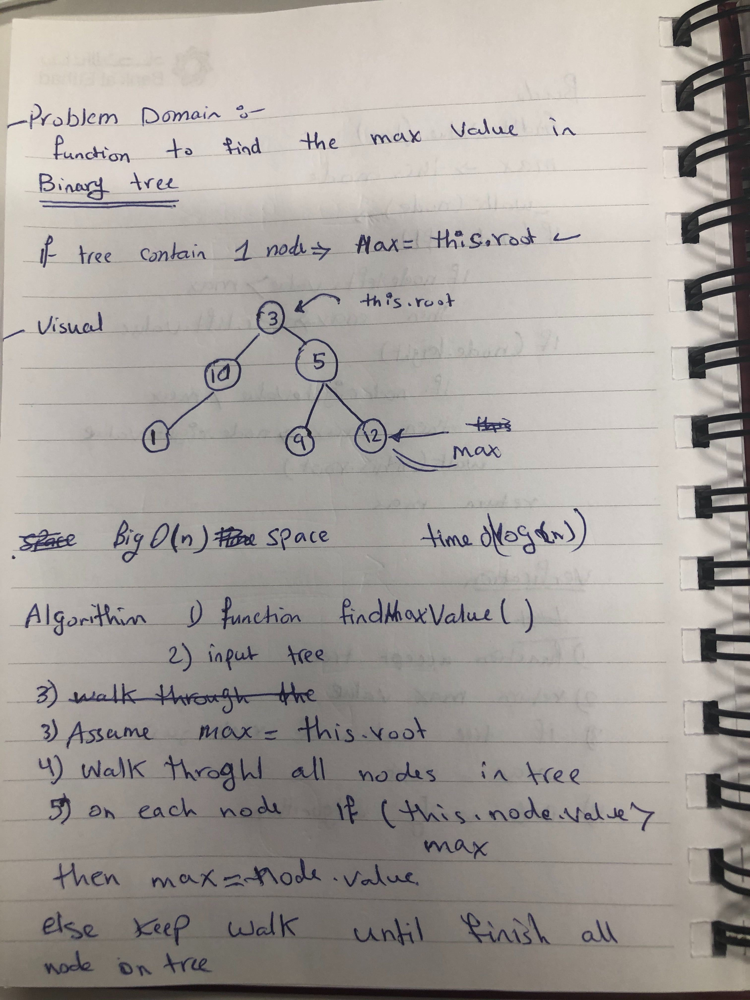
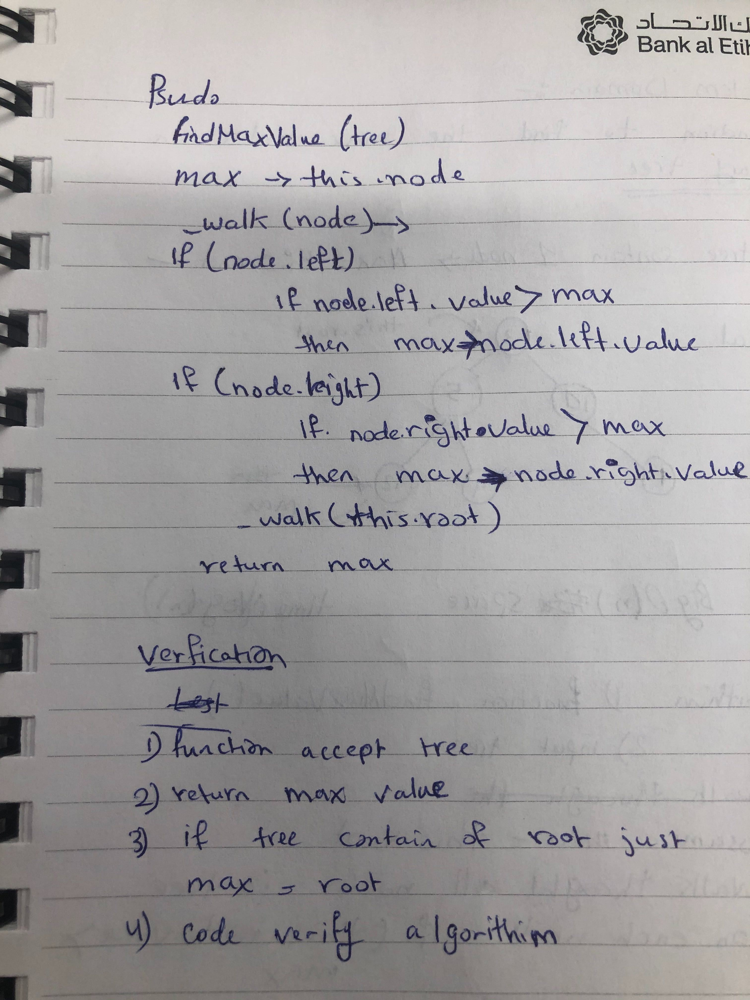

# data-structures-and-algorithms

# Challenge Summary
- Tree

## Challenge Description
Find the max value in binary tree

## Approach & Efficiency
- add O(logn)

- includes O(logn)

- inOrder(),postOrder(),preOrder()  : O(n)

- findMaxVal() space O(n), time :O(log(n))

## Solution

