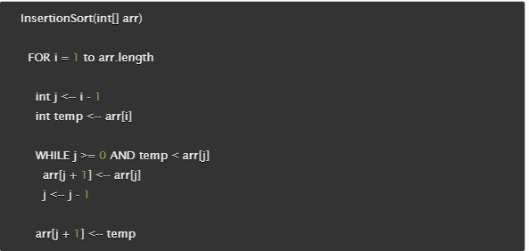
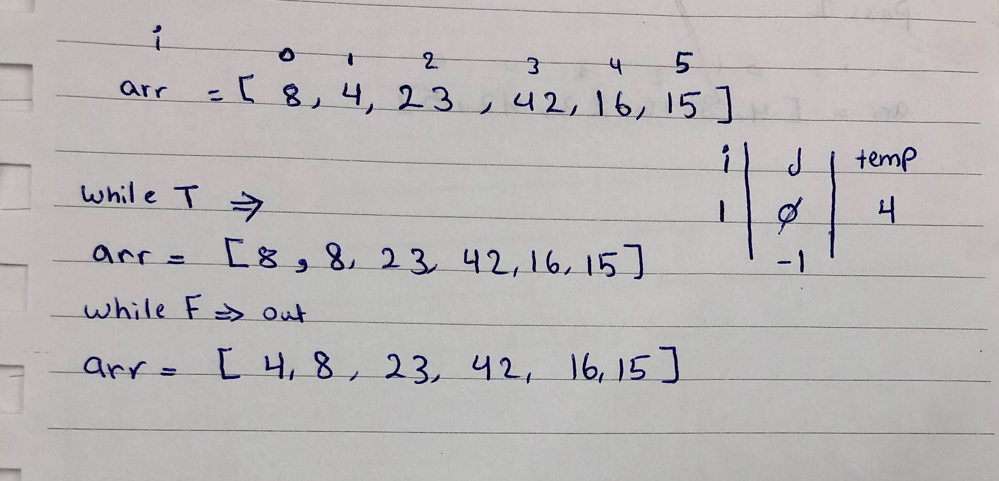
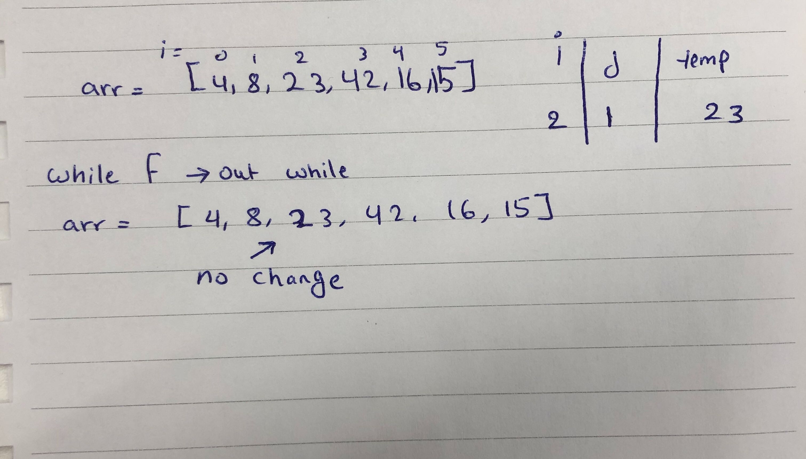
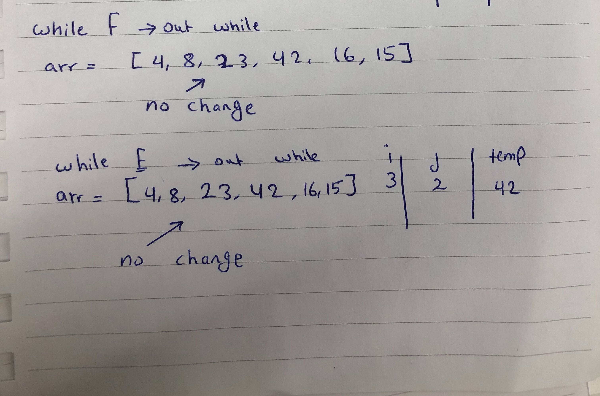
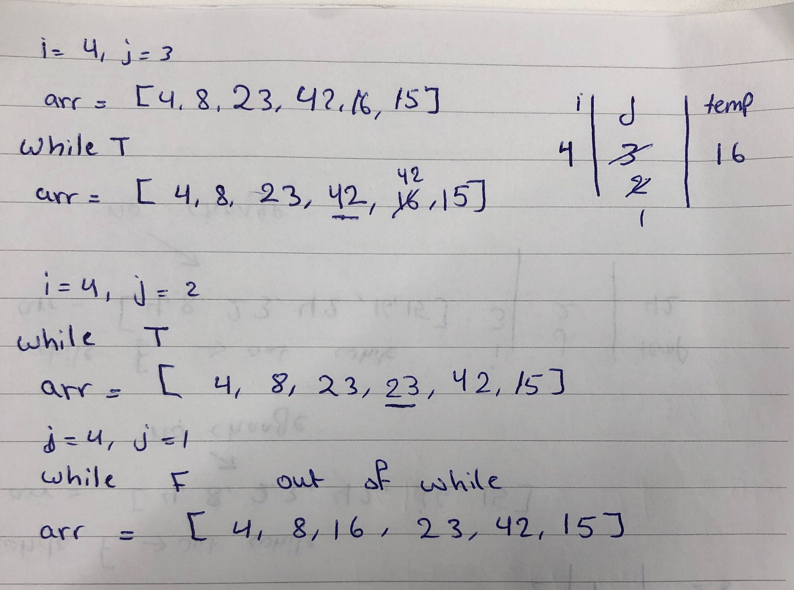
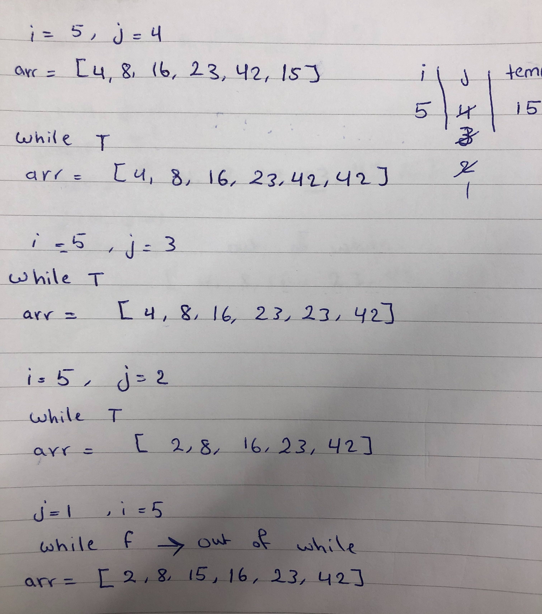
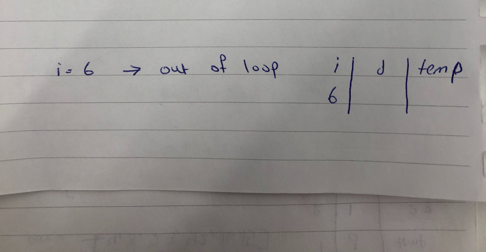

# Insertion Sort 

Selection Sort is a sorting algorithm that traverses the array multiple times as it slowly builds out the sorting sequence. The traversal keeps track of the minimum value and places it in the front of the array which should be incrementally sorted.

## Pseudocode

## Trace

### Sample Array: [8,4,23,42,16,15]

### Pass 1:

### Pass 2:

### Pass 3:

### Pass 4:

### Pass 5:

### Pass 6:

### Efficency
#### Time: O(n^2)
The basic operation of this algorithm is comparison. This will happen n * (n-1) number of times…concluding the algorithm to be n squared.
#### Space: O(1)
No additional space is being created. This array is being sorted in place…keeping the space at constant O(1).

 

