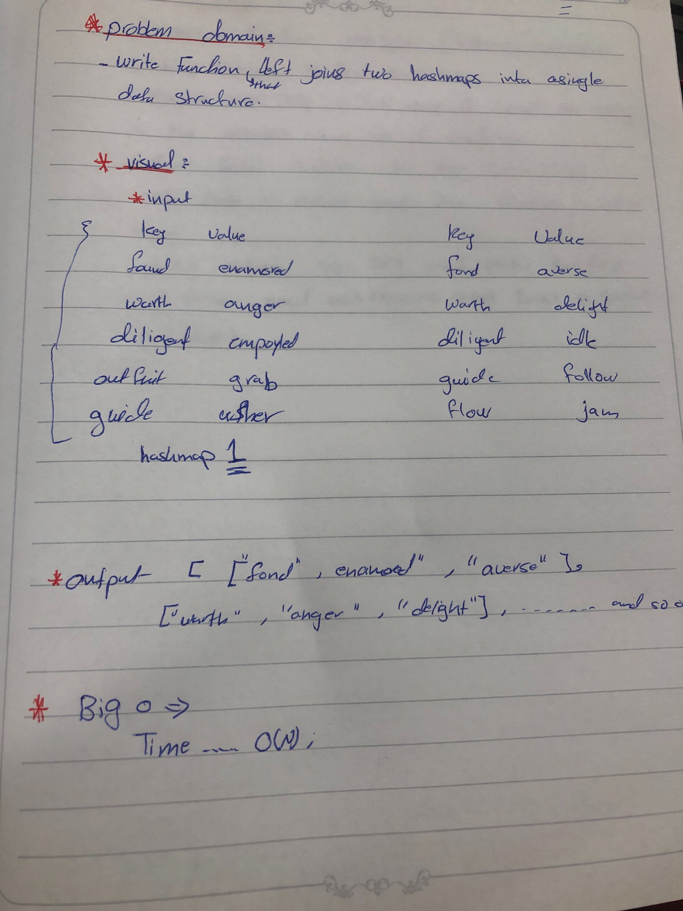
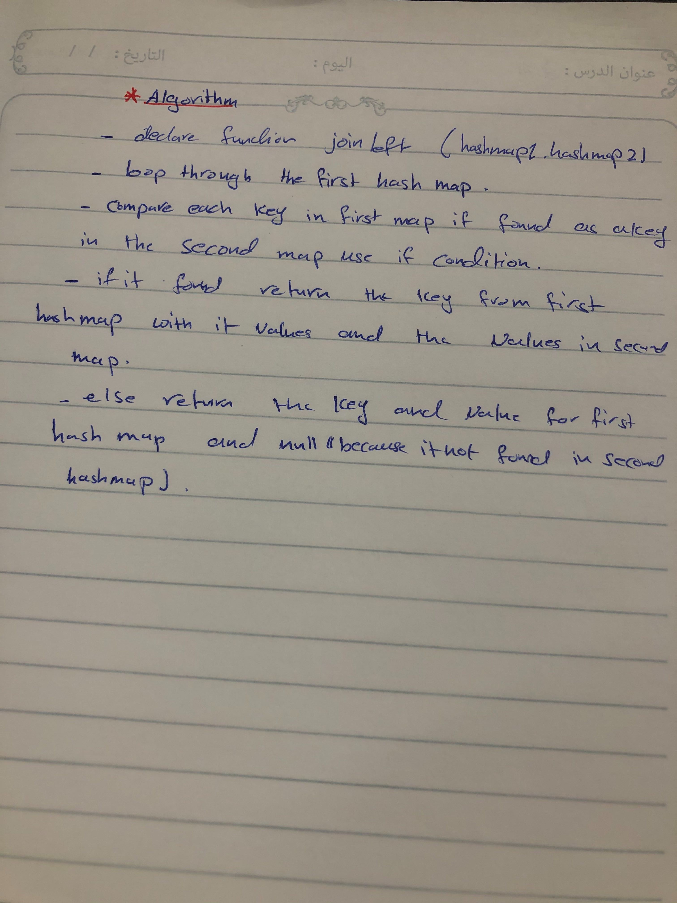

# data-structures-and-algorithms

## Challenge Summary

- figure out function and test it .

## Challenge Description

 - create  a function that LEFT JOINs two hashmaps into a single data structure.

## Approach & Efficiency

- leftJoin
- time .... O(n)

## solution

