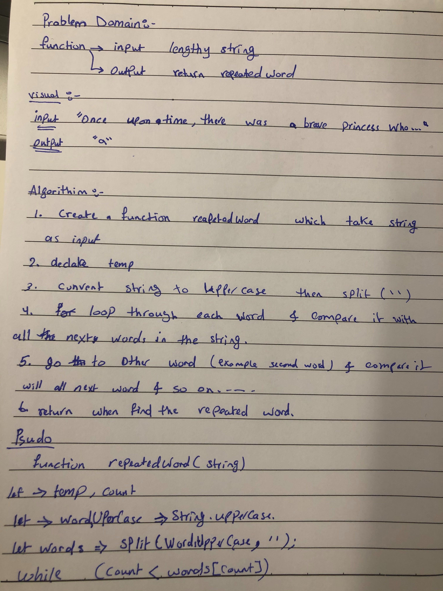
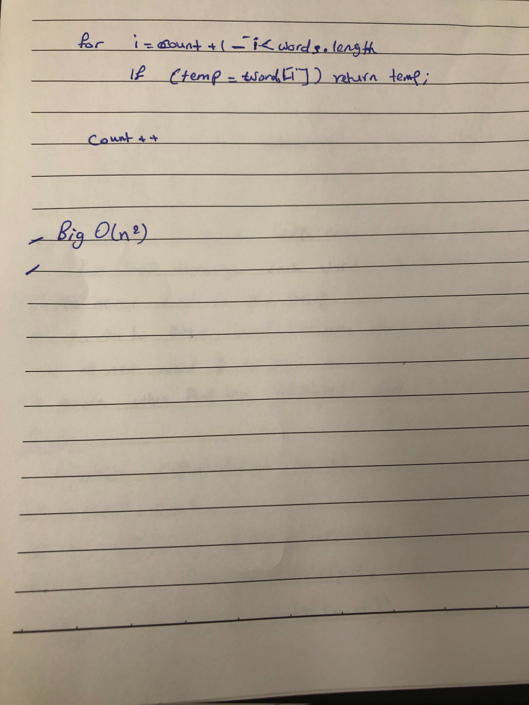

# data-structures-and-algorithms
 
- Done by Muna and Mai

# Repeated Words

## Challenge
- Write a function that accepts a lengthy string parameter.
- Without utilizing any of the built-in library methods available to your language, return the first word to occur more than once in that provided string.

## Approach & Efficiency

 - Big O(n^2)

## WhiteBoard

