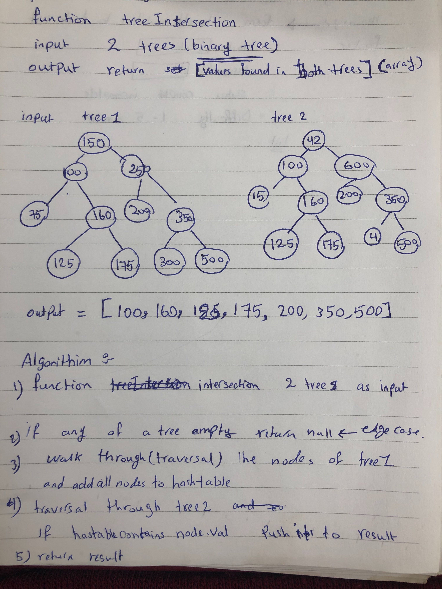

# data-structures-and-algorithms

# Tree Intersection

# Challenge Summary

- treeIntersection

## Challenge Description

Write a function called treeIntersection that takes two binary tree parameters.
Without utilizing any of the built-in library methods available to your language, return a set of values found in both trees.

## Approach & Efficiency

- Big : O(n)

- Space : O(1)

## Solution

